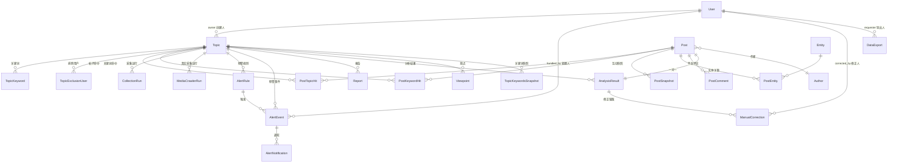

# 自动化舆情收集平台 · 技术文档

> 适用版本：v1.0（一期）　更新时间：2026-08-18
> 本文档面向开发、运维人员，介绍系统的技术架构、数据模型、接口清单、核心算法与部署方式。业务说明见《使用文档》。

---

## 一、项目概述

自动化舆情收集与分析平台面向品牌、剧集、综艺、艺人及重点营销事件，建设一套覆盖「主题配置 → 定时采集 → 数据处理 → 舆情分析 → 异常预警 → 结果导出」的自动化舆情监测能力。一期接入小红书、微博（真实采集）与模拟数据源。

平台由三大子项目组成：

| 子项目 | 目录 | 技术 | 职责 |
|---|---|---|---|
| 后端 | `Django/` | Python + Django 6.0 + DRF | 业务核心：主题管理、调度、采集、清洗去重、分析、预警、报告 |
| 前端 | `vue/` | Vue 3 + Vite + TypeScript + Element Plus | Web 管理界面（分析看板、主题、帖子、预警、报告等） |
| 采集引擎 | `Media/` | MediaCrawler（外部开源爬虫项目） | 小红书 / 微博真实数据抓取，由后端插件驱动 |

> `Media/` 为 NanmiCoder/MediaCrawler 开源爬虫项目的嵌入副本，作为真实采集执行引擎，可通过删除插件应用整体回滚。

---

## 二、系统架构

```
┌──────────────────────────────────────────────────────────────┐
│                          浏览器用户                            │
│                  Vue3 + Element Plus 前端 (vue/)               │
│                    Vite dev 代理 /api → :8000                 │
└──────────────────────────┬───────────────────────────────────┘
                           │ HTTP + JSON（JWT Bearer 认证）
┌──────────────────────────▼───────────────────────────────────┐
│                     Django 后端 (Django/)                      │
│  accounts(topics) tasks analysis alerts reports dashboard    │
│  topics / posts / collectors / collectors.plugins            │
├──────────────────────────────┬───────────────────────────────┤
│  调度器 APScheduler           │  采集执行                      │
│  · 主题定时任务 (Interval)    │  · MockCollector（模拟数据）    │
│  · 日报/周报 (Cron)          │  · MediaCrawler 插件（真实采集）│
│  · 预警巡检 / 关键词快照      │    uv run main.py ...          │
│  · 派发线程 ThreadPool(4)    │          │                     │
└──────────────────────────────┼───────────────────────────────┘
                               │ uv 执行 / 扫码登录 / JSONL 落盘
                    ┌──────────▼──────────┐
                    │  MediaCrawler (Media/)│
                    │  data/xhs|weibo/jsonl │
                    └──────────────────────┘
```

### 数据流转总览

```
主题定时/手动触发
  → enqueue_run 创建 CollectionRun（pending）
  → 派发线程并发 execute_run
      → collector.search() 采集（mock 生成 / MediaCrawler 抓取）
      → ingest_batch：清洗(junk/ad/排除词/排除作者)
           → content_hash 精确去重 → simhash 相似归并 → 落库 Post/快照/命中关系
      → analysis.pipeline.run_for_topic：规则层快判 → LLM 分析 → 热度 → 实体/观点
      → alerts.engine：6 类规则检测 → 冷却期 → AlertEvent → 站内/邮件通知
  → 周期任务：日报 9:00 / 周报周一 9:05、关键词快照 30min、预警巡检 10min、主题 job 对账 1min
  → 报告：聚合 dashboard 统计 + LLM 摘要（模板兜底）+ CSV 导出
```

---

## 三、技术栈与依赖

### 3.1 后端（Django/requirements.txt）

| 依赖 | 版本 | 用途 |
|---|---|---|
| Django | 6.0.8 | Web 框架 |
| djangorestframework | 3.17.2 | REST API |
| djangorestframework-simplejwt | 5.5.1 | JWT 认证（access 8h / refresh 7d，刷新轮换+黑名单） |
| django-cors-headers | 4.9.0 | 跨域 |
| django-filter | 26.1 | 接口过滤 |
| apscheduler | 3.11.3 | 任务调度 |
| requests | 2.34.2 | LLM HTTP 调用等 |
| anthropic | 0.120.2 | LLM 客户端（兼容保留） |
| simhash | 2.1.2 | 文本相似去重 |
| jieba | 0.42.1 | 中文分词 |
| python-dotenv | 1.2.2 | 读取 .env |
| xhs | 0.2.13 | 小红书采集库（默认禁用） |

### 3.2 前端（vue/package.json）

- **框架**：Vue 3.5（Composition API + `<script setup lang="ts">`）、TypeScript ~6.0、Vite 8、Vue Router 4（HTML5 History）、Pinia 3
- **UI**：Element Plus 2.14（中文 locale、图标全量注册）
- **可视化**：ECharts 5.6 + echarts-wordcloud 2.1
- **其他**：Axios（401 自动刷新重试）、Day.js
- **Node 要求**：`^22.18.0 || >=24.12.0`

### 3.3 MediaCrawler（Media/）

- uv 管理（`uv.lock`），Python >=3.11，依赖含 playwright、httpx、sqlalchemy、pandas 等
- 通过 `uv run main.py --platform xhs|wb --lt qrcode --type search --keywords ...` 执行抓取

---

## 四、目录结构

```
yuqing/
├── Django/                     # 后端主项目
│   ├── manage.py
│   ├── .env / .env.example     # 环境变量（.env 被 git 忽略）
│   ├── requirements.txt
│   ├── Djiango/                # 项目配置
│   │   ├── settings/{base,dev,prod}.py, __init__.py
│   │   ├── api_urls.py         # /api/ 路由总装
│   │   ├── urls.py, asgi.py, wsgi.py
│   │   └── pagination.py       # 分页（支持 ?page_size=，上限200）
│   ├── topics/                 # 舆情主题
│   ├── posts/                  # 帖子 + 清洗/去重/入库
│   ├── collectors/             # 采集器架构（base/registry/schemas/mock_collector）
│   │   └── plugins/            # 插件应用：MediaCrawler 集成、xhs/weibo 采集器、评论
│   ├── tasks/                  # 调度器 + CollectionRun
│   ├── analysis/               # 内容识别（规则 + LLM + 热度）
│   ├── alerts/                 # 预警规则/事件/通知
│   ├── reports/                # 报告生成 + 数据导出
│   ├── dashboard/              # 看板聚合统计
│   ├── accounts/               # JWT 认证 + 用户管理
│   ├── exports/                # 导出 CSV 输出目录
│   └── mediacrawler_logs/      # MediaCrawler 运行日志
├── vue/                        # 前端
│   └── src/
│       ├── api/                # axios 实例 + 模块化接口
│       ├── components/         # 图表组件、SentimentTag
│       ├── views/              # 页面（Login/Dashboard/topics/posts/alerts/reports/users/settings）
│       ├── router/             # 路由 + 导航守卫
│       ├── stores/             # Pinia（auth）
│       └── utils/token.ts      # token 持久化
├── Media/                      # MediaCrawler 采集引擎
│   ├── main.py                 # 爬虫入口（uv run）
│   ├── config/base_config.py   # 爬虫自身配置
│   └── data/{xhs,weibo}/jsonl/ # 抓取数据（search_contents_*.jsonl / search_comments_*.jsonl）
├── 需求/                       # 业务需求文档
├── docs/collector_guide.md     # 采集器接入指南
└── 文档/                       # 技术文档 + 使用文档（本文档所在）
```

---

## 五、数据模型

### 5.1 topics —— 舆情主题

**Topic**
| 字段 | 类型 | 说明 |
|---|---|---|
| name | CharField | 主题名称 |
| description | TextField | 描述 |
| platforms | JSONField(list) | 采集平台：xiaohongshu / weibo / mock |
| collection_interval | IntegerField | 采集频率（分钟），5~1440，默认 30 |
| monitor_start / monitor_end | DateTimeField | 监测周期（可空） |
| status | CharField | active / paused / archived / deleted |
| owner | FK→User | 创建人（SET_NULL） |

**TopicKeyword**（关键词子表）：`topic` + `word` + `kind`（core 核心词 / related 关联词 / exclude 排除词）
**TopicExclusionUser**：`topic` + `platform` + `author_name`（排除用户，唯一约束三者组合）

> 关键词不存 Topic 字段，而是子表 `TopicKeyword`；Topic 提供 `core_keywords / related_keywords / exclude_keywords` 属性。

### 5.2 posts —— 帖子

- **Author**：platform、author_id、name、avatar_url、follower_count、profile_url、is_key_author
- **Post**：post_id + platform（唯一约束）、url（unique）、title/content、content_hash（db_index）、author(FK)、published_at/collected_at、互动四数（like/comment/share/favorite）、hashtags/images（JSON）、dedup_group（相似去重组）、is_deleted（软删）
- **PostTopicHit**：帖子↔主题命中关系，唯一 (post, topic)，`matched_keywords`(JSON) + `matched_count`
- **PostKeywordHit**：命中关键词明细，唯一 (post, topic, keyword)，`matched_text` 命中原文
- **PostSnapshot**：互动历史快照（供点赞趋势图）

### 5.3 alerts —— 预警

- **AlertRule**：topic + name + rule_type（6 种）+ config(JSON) + level（low/medium/high/critical）+ enabled + notify_channels(JSON) + notify_recipients(JSON) + cooldown_minutes（冷却防抖）
- **AlertEvent**：rule + topic + triggered_at + reason + matched_posts(JSON) + matched_keywords(JSON) + metrics(JSON) + status（new/acknowledged/resolved）+ handled_by/handled_at
- **AlertNotification**：event + channel（platform/email）+ recipient + status（pending/sent/failed）+ error_message

### 5.4 reports —— 报告与导出

- **DataExport**：requester + export_type（post/full）+ filters(JSON) + file_path + status（pending/running/done/failed）+ row_count
- **Report**：topic + period_type（daily/weekly）+ report_date + title + summary + statistics(JSON) + chart_image + status（generating/done/failed）

### 5.5 tasks —— 采集运行

- **CollectionRun**：topic + platform + status（pending/running/success/failed/canceled）+ trigger_type（schedule/manual）+ 各计数（fetched/new/updated/duplicate/retry）+ error_message + cursor（增量游标）
- APScheduler 调度任务无持久化模型，运行状态由 `tasks/views.py::scheduler_status` 动态读取。

### 5.6 analysis —— 分析结果

- **AnalysisResult**（每帖一条，Post OneToOne）：related_score/is_related、sentiment（positive/neutral/negative/unknown）、sentiment_score、sentiment_source（rule/llm/manual）、key_viewpoints/key_entities/high_freq_keywords(JSON)、heat_score
- **Entity**（name+type 唯一）、**PostEntity**、**Viewpoint**（topic+text 唯一）、**ManualCorrection**（人工修正留痕）

### 5.7 dashboard —— 聚合缓存

- **TopicKeywordsSnapshot**：topic + window（如 7d）+ keywords(JSON)

### 5.8 collectors.plugins —— 插件模型

- **PostComment**：平台评论
- **MediaCrawlerRun**：真实采集运行（platform/topic/keywords/status/log_path/pid/exit_code/计数/snapshot_lines）
- **MediaCrawlerFileState**：文件导入断点续传

> **User 模型未自定义**：使用 Django 内置 `auth.User`；`name` 映射 `first_name`，`role` 由 `is_staff` 派生（admin 管理员 / operator 运营）。

### 5.9 ER 图（实体关系）



> 图中 `||--o{` 表示一对多、`||--||` 一对一、`}o--||` 多对一。字段明细见上文 5.1~5.8 各表。

---

## 六、API 接口清单

所有接口前缀 `/api/`，默认要求登录（`IsAuthenticated`），管理员接口使用 `accounts/permissions.py` 的 `IsAdmin`（`is_staff=True`）。分页默认 20 条/页，支持 `?page_size=`（上限 200）。

### 6.1 认证与用户 `/api/auth/`、`/api/users/`

| 方法 | 路径 | 功能 | 权限 |
|---|---|---|---|
| POST | `/api/auth/login/` | 登录（限流 20/min），返回 access/refresh/user | 公开 |
| POST | `/api/auth/refresh/` | 刷新 access token | 公开 |
| POST | `/api/auth/logout/` | 登出（refresh 进黑名单） | 登录 |
| GET | `/api/auth/me/` | 当前用户信息 | 登录 |
| GET/POST | `/api/users/` | 用户列表 / 创建 | 管理员 |
| PATCH | `/api/users/{id}/` | 更新用户（name/role/is_active） | 管理员 |
| POST | `/api/users/{id}/reset_password/` | 重置密码 | 管理员 |
| DELETE | `/api/users/{id}/` | 停用用户 | 管理员 |

### 6.2 主题 `/api/topics/`

| 方法 | 路径 | 功能 |
|---|---|---|
| GET/POST | `/api/topics/` | 列表（name/status 过滤）/ 创建（keywords_inline、excluded_users_inline） |
| GET/PATCH | `/api/topics/{id}/` | 详情 / 更新（keywords 全量替换） |
| DELETE | `/api/topics/{id}/` | 硬删除并清理该主题帖子 |
| POST | `/api/topics/{id}/pause/` | 暂停采集 |
| POST | `/api/topics/{id}/resume/` | 恢复采集 |
| POST | `/api/topics/{id}/collect_now/` | 立即采集（模拟数据同步执行；小红书/微博提示走 MediaCrawler） |
| GET | `/api/topics/{id}/stats/` | 主题统计（总量/今日新增/情感分布/负面数） |

### 6.3 帖子 `/api/posts/`

| 方法 | 路径 | 功能 |
|---|---|---|
| GET | `/api/posts/` | 列表；过滤 topic/platform/sentiment/is_related/q/ordering（支持 heat_score） |
| GET | `/api/posts/{id}/` | 详情（嵌套 author、topic_hits、analysis） |
| GET | `/api/posts/{id}/history/` | 互动历史快照 |

### 6.4 预警 `/api/alerts/`

| 方法 | 路径 | 功能 |
|---|---|---|
| GET/POST | `/api/alerts/rules/` | 规则列表 / 创建（落库后回溯检查近 24h 数据） |
| PATCH/DELETE | `/api/alerts/rules/{id}/` | 规则更新 / 删除 |
| GET | `/api/alerts/events/` | 事件列表（topic/status/level 过滤） |
| POST | `/api/alerts/events/{id}/ack/` | 确认事件 |
| POST | `/api/alerts/events/{id}/resolve/` | 标记解决 |
| GET | `/api/alerts/notifications/` | 通知记录 |

### 6.5 报告与导出 `/api/reports/`

| 方法 | 路径 | 功能 |
|---|---|---|
| GET/POST | `/api/reports/exports/` | 导出任务列表 / 创建（同步生成 CSV） |
| GET | `/api/reports/exports/{id}/download/` | 下载 CSV |
| GET | `/api/reports/reports/` | 报告列表 |
| GET | `/api/reports/reports/{id}/` | 报告详情 |
| POST | `/api/reports/reports/generate/` | 手动生成（topic + period_type=daily\|weekly） |

### 6.6 看板统计 `/api/dashboard/`（全部 GET）

`overview/` 总览、`trend/` 趋势、`platform-distribution/` 平台分布、`sentiment-distribution/` 情感分布、`interaction-trend/` 互动趋势、`hot-posts/` 热门帖、`negative-posts/` 负面帖、`top-keywords/` 高频关键词（LLM 精选）、`heat-trend/` 热度趋势、`key-authors/` 重点账号、`topic-compare/` 主题对比
（公共参数：topic_ids/platform/start/end，多数支持 limit/bucket）

### 6.7 分析 / 采集器 / 调度 / 爬虫

| 方法 | 路径 | 功能 |
|---|---|---|
| POST | `/api/analysis/{id}/correct/` | 人工修正分析结果（sentiment/related/viewpoint/entities） |
| GET | `/api/collectors/` | 各平台采集器启用状态与缺失配置 |
| POST | `/api/collectors/{platform}/test/` | 采集器测试（管理员） |
| GET | `/api/crawler/comments/?post=` | 帖子平台评论 |
| POST | `/api/crawler/mediacrawler/run/` | 启动 MediaCrawler 采集（topic_id/platform/max_notes） |
| GET | `/api/crawler/mediacrawler/status/` | 运行状态 + 日志尾部（前端 2s 轮询） |
| POST | `/api/crawler/mediacrawler/stop/` | 停止采集 |
| POST | `/api/crawler/mediacrawler/import/` | 手动补导入已有抓取数据 |
| GET | `/api/tasks/runs/` | 采集运行记录列表 |
| GET | `/api/tasks/status/` | 调度器状态（运行中/派发线程/任务列表/队列/最近失败） |

### 6.8 接口示例（请求 / 响应）

> 认证头：除登录/刷新外，所有请求需携带 `Authorization: Bearer <access>`。分页列表为 DRF 标准格式：`{"count", "next", "previous", "results"}`，可用 `?page_size=` 覆盖每页条数（上限 200）。

#### 示例 1：登录

```http
POST /api/auth/login/
Content-Type: application/json

{ "username": "admin", "password": "你的密码" }
```

```json
// 200 OK
{
  "access": "eyJhbGciOiJIUzI1NiIs...",   // 有效期 8 小时
  "refresh": "eyJhbGciOiJIUzI1NiIs...",   // 有效期 7 天，刷新时轮换并黑名单旧 token
  "user": {
    "id": 1,
    "username": "admin",
    "name": "系统管理员",
    "role": "admin",
    "is_active": true,
    "is_staff": true,
    "date_joined": "2026-08-01T10:00:00+08:00"
  }
}
```

#### 示例 2：创建舆情主题

```http
POST /api/topics/
Authorization: Bearer <access>
Content-Type: application/json

{
  "name": "芒果TV",
  "description": "芒果TV品牌舆情监测",
  "platforms": ["xiaohongshu", "mock"],
  "collection_interval": 30,
  "monitor_start": "2026-08-01T00:00:00+08:00",
  "keywords_inline": [
    { "word": "芒果TV",     "kind": "core" },
    { "word": "芒果会员",   "kind": "core" },
    { "word": "芒果",       "kind": "related" },
    { "word": "水果",       "kind": "exclude" }
  ]
}
```

```json
// 201 Created —— 返回完整主题（含回填后的 keywords、collecting 状态）
{
  "id": 1,
  "name": "芒果TV",
  "description": "芒果TV品牌舆情监测",
  "platforms": ["xiaohongshu", "mock"],
  "collection_interval": 30,
  "monitor_start": "2026-08-01T00:00:00+08:00",
  "monitor_end": null,
  "status": "active",
  "owner": 1,
  "collecting": false,
  "created_at": "2026-08-18T09:30:00+08:00",
  "updated_at": "2026-08-18T09:30:00+08:00",
  "keywords": [
    { "id": 1, "topic": 1, "word": "芒果TV",   "kind": "core" },
    { "id": 2, "topic": 1, "word": "芒果会员", "kind": "core" },
    { "id": 3, "topic": 1, "word": "芒果",     "kind": "related" },
    { "id": 4, "topic": 1, "word": "水果",     "kind": "exclude" }
  ],
  "excluded_users": []
}
```

> 更新主题：`PATCH /api/topics/{id}/`，body 提供 `keywords` 数组（全量替换）、`excluded_users` 数组（全量替换）或任意可编辑字段。

#### 示例 3：立即采集（模拟平台）

```http
POST /api/topics/1/collect_now/
Authorization: Bearer <access>
```

```json
// 200 OK —— 按主题平台逐个同步执行，返回各平台运行结果
{
  "runs": [
    {
      "run_id": 1001,
      "platform": "mock",
      "status": "success",
      "fetched_count": 50,
      "new_count": 32,
      "duplicate_count": 18,
      "updated_count": 0,
      "error_message": null
    },
    {
      "run_id": null,
      "platform": "xiaohongshu",
      "status": "skipped",
      "fetched_count": 0,
      "new_count": 0,
      "duplicate_count": 0,
      "updated_count": 0,
      "error_message": "该平台未启用内置采集器；小红书/微博请用 MediaCrawler 采集"
    }
  ]
}
```

#### 示例 4：启动 MediaCrawler 真实采集

```http
POST /api/crawler/mediacrawler/run/
Authorization: Bearer <access>
Content-Type: application/json

{ "topic_id": 1 }          // platform 可省略：按主题自动推导 xiaohongshu→xhs, weibo→wb
```

```json
// 201 Created —— 每个真实平台一条运行记录，浏览器弹出二维码等待扫码
[
  {
    "id": 2001,
    "platform": "xhs",
    "topic": 1,
    "topic_name": "芒果TV",
    "keywords": "芒果TV,芒果会员,芒果",
    "status": "running",
    "status_label": "运行中",
    "pid": 12345,
    "exit_code": null,
    "fetched_count": 0,
    "new_count": 0,
    "duplicate_count": 0,
    "updated_count": 0,
    "comment_count": 0,
    "error_message": null,
    "started_at": "2026-08-18T09:30:00+08:00",
    "finished_at": null
  }
]
```

```http
GET /api/crawler/mediacrawler/status/?topic=1
Authorization: Bearer <access>
```

```json
// 200 OK —— 前端 2 秒轮询此接口；run 为 null 表示暂无运行记录
{
  "running": true,
  "run": {
    "id": 2001,
    "platform": "xhs",
    "topic": 1,
    "topic_name": "芒果TV",
    "keywords": "芒果TV,芒果会员,芒果",
    "status": "importing",
    "status_label": "导入中",
    "pid": 12345,
    "exit_code": 0,
    "fetched_count": 38,
    "new_count": 26,
    "duplicate_count": 12,
    "updated_count": 0,
    "comment_count": 152,
    "error_message": null,
    "started_at": "2026-08-18T09:30:00+08:00",
    "finished_at": null
  },
  "log_tail": "2026-08-18 09:31:02 [INFO] 关键词「芒果TV」抓取完成...\n...（最多 300 行）"
}
```

#### 示例 5：帖子列表（筛选 + 排序 + 分页）

```http
GET /api/posts/?topic=1&platform=xiaohongshu&sentiment=negative&ordering=-heat_score&page=1&page_size=10
Authorization: Bearer <access>
```

```json
// 200 OK
{
  "count": 128,
  "next": "http://127.0.0.1:8000/api/posts/?page=2&page_size=10",
  "previous": null,
  "results": [
    {
      "id": 501,
      "post_id": "62a3c1b0000...",
      "platform": "xiaohongshu",
      "url": "https://www.xiaohongshu.com/explore/62a3c1b0000...",
      "title": "芒果TV又搞事",
      "content": "芒果TV会员居然还要看广告……",
      "author": 10,
      "author_name": "瓜田情报站",
      "author_followers": 23000,
      "published_at": "2026-08-18T09:00:00+08:00",
      "collected_at": "2026-08-18T09:05:00+08:00",
      "like_count": 3250,
      "comment_count": 480,
      "share_count": 96,
      "favorite_count": 210,
      "hashtags": ["芒果TV", "吐槽"],
      "cover_url": "https://sns-img-.../cover.webp",
      "images": [],
      "sentiment": "negative",
      "heat_score": 87.3,
      "topic_ids": [1]
    }
  ]
}
```

#### 示例 6：帖子详情（含分析结果）

```http
GET /api/posts/501/
Authorization: Bearer <access>
```

```json
// 200 OK —— 在列表字段基础上追加 author/topic_hits/analysis
{
  "id": 501,
  "post_id": "62a3c1b0000...",
  "platform": "xiaohongshu",
  "url": "https://www.xiaohongshu.com/explore/62a3c1b0000...",
  "title": "芒果TV又搞事",
  "content": "芒果TV会员居然还要看广告……",
  "author": {
    "id": 10,
    "platform": "xiaohongshu",
    "author_id": "5a...",
    "name": "瓜田情报站",
    "avatar_url": "https://...",
    "follower_count": 23000,
    "profile_url": "https://www.xiaohongshu.com/user/profile/5a...",
    "is_key_author": true
  },
  "author_name": "瓜田情报站",
  "author_followers": 23000,
  "published_at": "2026-08-18T09:00:00+08:00",
  "collected_at": "2026-08-18T09:05:00+08:00",
  "like_count": 3250,
  "comment_count": 480,
  "share_count": 96,
  "favorite_count": 210,
  "hashtags": ["芒果TV", "吐槽"],
  "cover_url": "https://sns-img-.../cover.webp",
  "images": [],
  "sentiment": "negative",
  "heat_score": 87.3,
  "topic_ids": [1],
  "topic_hits": [
    {
      "id": 100,
      "topic": 1,
      "topic_name": "芒果TV",
      "matched_keywords": ["芒果TV", "芒果会员"],
      "matched_count": 2,
      "first_hit_at": "2026-08-18T09:05:00+08:00"
    }
  ],
  "analysis": {
    "id": 301,
    "post": 501,
    "post_content": "芒果TV会员居然还要看广告……",
    "post_url": "https://www.xiaohongshu.com/explore/62a3c1b0000...",
    "post_platform": "xiaohongshu",
    "topic": 1,
    "topic_name": "芒果TV",
    "related_score": 0.98,
    "is_related": true,
    "sentiment": "negative",
    "sentiment_score": 0.87,
    "sentiment_source": "llm",
    "key_viewpoints": ["会员还要看广告，体验差"],
    "key_entities": ["芒果TV", "会员"],
    "high_freq_keywords": ["广告", "会员", "体验"],
    "heat_score": 87.3,
    "analyzed_at": "2026-08-18T09:06:00+08:00",
    "updated_at": "2026-08-18T09:06:00+08:00"
  }
}
```

#### 示例 7：看板总览

```http
GET /api/dashboard/overview/?topic=1
Authorization: Bearer <access>
```

```json
// 200 OK —— 时间窗口默认最近 30 天
{
  "post_count": 842,
  "new_today": 35,
  "negative_count": 21,
  "sentiment_distribution": { "positive": 522, "neutral": 202, "negative": 21, "unknown": 97 },
  "avg_heat": 32.45,
  "alert_count": 3
}
```

> 其他看板接口返回值：`platform-distribution` → `{"xiaohongshu": 320, "weibo": 522}`；`interaction-trend` → `[{"time":"2026-08-18T09:00:00+08:00","likes":..,"comments":..,"shares":..,"favorites":..}]`；`hot-posts`/`negative-posts` → `[{"id","post_id","content","url","platform","author","like_count","comment_count","sentiment","heat_score","published_at"}]`；`top-keywords?window=7d` → `[{"keyword":"迪丽热巴","count":32}]`；`heat-trend` → `[{"time":...,"heat":32.5}]`。

#### 示例 8：创建预警规则

```http
POST /api/alerts/rules/
Authorization: Bearer <access>
Content-Type: application/json

{
  "topic": 1,
  "name": "负面内容激增",
  "rule_type": "negative_spike",
  "config": { "window_minutes": 60, "growth_ratio": 2.0, "min_count": 5 },
  "level": "high",
  "enabled": true,
  "notify_channels": ["platform", "email"],
  "notify_recipients": ["ops@example.com"],
  "cooldown_minutes": 60
}
```

```json
// 201 Created —— 创建后系统自动对近 24h 数据回溯检查
{
  "id": 5,
  "topic": 1,
  "topic_name": "芒果TV",
  "name": "负面内容激增",
  "rule_type": "negative_spike",
  "rule_type_label": "负面帖数量激增",
  "config": { "window_minutes": 60, "growth_ratio": 2.0, "min_count": 5 },
  "level": "high",
  "level_label": "高",
  "enabled": true,
  "notify_channels": ["platform", "email"],
  "notify_recipients": ["ops@example.com"],
  "cooldown_minutes": 60,
  "created_at": "2026-08-18T09:40:00+08:00",
  "updated_at": "2026-08-18T09:40:00+08:00"
}
```

> 各规则类型 `config` 字段：`negative_keyword`→`{keywords:[...], min_count}`；`like_threshold`→`{threshold}`；`negative_spike`→`{window_minutes, growth_ratio, min_count}`；`coordinated_posting`→`{window_minutes, min_posts, min_accounts}`；`interaction_spike`→`{growth_ratio, min_abs}`；`key_author_negative`→`{}`。

#### 示例 9：生成日报并导出

```http
POST /api/reports/reports/generate/
Authorization: Bearer <access>
Content-Type: application/json

{ "topic": 1, "period_type": "daily" }
```

```json
// 201 Created —— 报告含 LLM 摘要与统计快照（未配 LLM 时为模板摘要）
{
  "id": 30,
  "topic": 1,
  "topic_name": "芒果TV",
  "period_type": "daily",
  "period_type_label": "日报",
  "report_date": "2026-08-17",
  "title": "芒果TV 舆情日报（2026-08-17）",
  "summary": "当日共采集 842 条相关帖子，负面 21 条（占比 2.5%）。讨论焦点集中在会员服务与广告体验……建议关注「自动续费」负面上升趋势。",
  "statistics": { "post_count": 842, "negative_count": 21 },
  "chart_image": null,
  "status": "done",
  "status_label": "已完成",
  "created_at": "2026-08-18T09:45:00+08:00",
  "generated_at": "2026-08-18T09:45:02+08:00"
}
```

```http
POST /api/reports/exports/
Authorization: Bearer <access>
Content-Type: application/json

{ "export_type": "full", "filters": { "topic": 1, "sentiment": "negative" } }
```

```json
// 201 Created
{
  "id": 88,
  "requester": 1,
  "requester_name": "admin",
  "export_type": "full",
  "filters": { "topic": 1, "sentiment": "negative" },
  "file_path": "exports/export_20260818_094500.csv",
  "status": "done",
  "status_label": "已完成",
  "row_count": 21,
  "download_url": "http://127.0.0.1:8000/api/reports/exports/88/download/",
  "created_at": "2026-08-18T09:45:00+08:00",
  "finished_at": "2026-08-18T09:45:01+08:00"
}
```

#### 示例 10：调度器状态

```http
GET /api/tasks/status/
Authorization: Bearer <access>
```

```json
// 200 OK —— 仅管理员可见
{
  "scheduler_running": true,
  "dispatch_running": true,
  "active_jobs": [
    {
      "id": "topic_1",
      "name": "主题定时采集：芒果TV",
      "kind": "topic",
      "topic_id": 1,
      "topic_name": "芒果TV",
      "trigger": "interval[0:30:00]",
      "interval_minutes": 30,
      "next_run_time": "2026-08-18T10:00:00+08:00",
      "last_run_at": "2026-08-18T09:30:01+08:00",
      "last_run_status": "success"
    },
    { "id": "report_daily", "name": "日报自动生成", "kind": "report", "trigger": "cron[hour='9']", "next_run_time": "2026-08-19T09:00:00+08:00" }
  ],
  "pending_queue": 0,
  "running_count": 1,
  "recent_failed": []
}
```

#### 示例 11：人工修正分析结果

```http
POST /api/analysis/301/correct/
Authorization: Bearer <access>
Content-Type: application/json

{ "field": "sentiment", "corrected_value": "neutral", "note": "手动复核，属吐槽非负面" }
```

```json
// 200 OK —— 写 ManualCorrection 留痕并同步 AnalysisResult
{
  "id": 301,
  "sentiment": "neutral",
  "sentiment_source": "manual",
  "updated_at": "2026-08-18T10:00:00+08:00"
}
```

---

## 七、核心业务逻辑与算法

### 7.1 采集器架构（可插拔）

- `collectors/base.py` 定义抽象接口 `BaseCollector`：
  - `search(query) -> CollectResult`：按关键词执行一次采集
  - `fetch_interactions(post_ids) -> dict`：批量刷新互动数据
  - `validate() -> list[str]`：返回缺失的配置项
- `collectors/registry.py`：`register(platform)` 注册、`get_collector(platform)`（受 `COLLECTORS_ENABLED` 开关控制）、`list_collectors()`（展示启用状态）。
- 数据契约 `RawPost`：post_id/platform/url/title/content/author/互动四数/hashtags/images/extra。
- 完整接入指南见 `docs/collector_guide.md`。

**当前采集源启用状态**：`mock` 启用；`xiaohongshu`、`weibo` 内置采集器注册但**禁用**，真实采集统一由 MediaCrawler 插件承担（避免两套真实采集路径互相干扰）。

**MockCollector**（模拟数据源）：
- 中文模板三组（positive/neutral/negative），`{keyword}` 渲染真实命中词
- **可复现**：按 `topic_id:platform:date_slot` 做 SHA1 种子构造 `random.Random`，同主题同小时数据稳定
- 情感分布默认 `{positive 0.62, neutral 0.24, negative 0.14}`；配置 `negative_burst_hour` 可在指定小时注入负面激增（0.15/0.25/0.60）
- 高热帖（4%）：互动量乘 `uniform(5,50)`；普通帖乘 `uniform(0.6,3.0)`
- extra 标记 `is_key_author` / `is_excluded_author`，供重点账号规则测试

### 7.2 调度器

**两段式派发**：
1. `enqueue_run()` 事务内创建 pending 记录（只入队不执行）
2. 派发线程（`DispatchManager`）每 5s `dispatch_once()`：按创建顺序取 pending run，**DB 原子抢占**（`UPDATE ... WHERE status='pending'`）+ 内存 `_inflight` 集合双保险防重复执行，`ThreadPoolExecutor(max_workers=4)` 并发执行

**execute_run 工作流**：置 running → 校验主题 active + 在监测窗口 → 组装 CollectQuery（核心+关联关键词，limit=200，增量 cursor）→ 采集 → 入库（清洗/去重）→ 内容识别 → 预警检查 → 非 mock 平台刷新互动快照 → 统计并置 success。

**重试退避**：`[1, 5, 15]` 分钟，`max_retries=3`，用 APScheduler date 触发器延时重试，重试前抢锁防双重执行。

**采集频率 → 定时**：`IntervalTrigger(minutes=topic.collection_interval)`。对账线程每分钟巡检，仅在 job 不存在或 interval 变化时重建，避免 `replace_existing` 重置 next_run_time 导致永不触发。同主题同平台已有 pending 时跳过防堆积。

**周期任务**：日报 9:00、周报周一 9:05（cron）；关键词快照每 30 分钟；预警巡检每 10 分钟；主题 job 对账每分钟；启动时对账卡死的 MediaCrawler 运行。

### 7.3 清洗与去重

**清洗（posts/services/clean.py）**：
- `normalize_text`：去 HTML 标签、零宽字符、压缩空白
- `is_junk`：纯空白/纯标点
- `is_ad`：正则特征——「加微信」「私信领取/代购」「扫码下单」「代购/刷单/拉群/微商」、3 个以上外链
- 排除词（kind=exclude 子串匹配）、排除作者（按平台过滤）

**去重（ingest_batch + dedupe.py）**，优先级：
1. 本批 batch 内 `seen_hashes` 重复 → duplicate
2. 库内 `content_hash`（SHA256 归一化文本）相同 → 更新互动 + 记快照 + 关联主题
3. `(platform, post_id)` 平台侧 ID 重复（跨关键词同帖）→ 归并
4. simhash 相似组（海明距离 ≤6，最少 8 个字级 2-gram）→ 归并
5. 否则新建 Post

**互动更新只增不减**（`value > post.field` 才覆盖），每次重采记 `PostSnapshot`。
**主题归属**：无条件关联 `PostTopicHit`；`matched_keywords` 用 `_match_keywords`（ASCII 整词边界、中文子串、长词退化 2 字滑窗）写 `PostKeywordHit`。
**并发兜底**：唯一约束冲突后重查归并。

### 7.4 内容识别（分析）

**热度公式（analysis/services/heat.py）**：
```
原始热度 = (like + comment×3 + share×4 + favorite×2) / max(age_hours, 1)^0.8
归一化   = 100 × log10(1 + 原始) / log10(1 + 最大值)
```

**混合识别流水线（pipeline.run_for_topic）**：
1. 用 `LEFT JOIN` 排除已分析帖（每帖只分析一次），取最多 500 条
2. 规则层：不相关直接判定（score 0.2，source=rule）；相关帖先按负面词→正面词→中性词规则算出兜底
3. LLM 层（DeepSeek，OpenAI 兼容）：配置了 Key 时相关帖全部交给 LLM；失败/缺失用规则兜底（source 保留 rule）
4. 落库 `AnalysisResult` + `Entity/PostEntity`（mention_count+1）+ `Viewpoint`（合并计数）

**LLM 调用（analysis/services/llm.py）**：
- 批处理：batch_size=16、并发 3、`response_format=json_object`，输出 JSON 数组按 post_id 序号对齐
- **Token 预算**：估算 `max(sum_chars//2, 64) + max_tokens(8192)`，按日累计存 Django cache，超 `daily_token_budget=40M` 自动降级规则层
- 重试 3 次，JSON 解析容错（去代码块、取 `[]`）
- `chat()` 为全站统一 LLM 入口（报告摘要也用它）；未配置 Key 时 `get_llm_backend()` 返回 None，全站静默降级规则层/模板，平台始终可用

### 7.5 预警引擎

**触发点**：① 每次采集/导入后 `check_after_collection`（带 touched_post_ids 精确扫描，重复采集也能触发）；② 每 10 分钟周期巡检（只扫有启用规则的 active 主题）。

**工作流**：遍历启用规则 → checker → **冷却期**（`cooldown_minutes`，查最近一次事件时间）→ 创建 AlertEvent → 派发通知。

**6 种规则类型**：
| 规则 | 检测逻辑 |
|---|---|
| negative_keyword | 帖子文本命中负面词，计数 ≥ min_count |
| like_threshold | 负面帖 like_count ≥ threshold（默认 1000） |
| negative_spike | 按**发布时间**分桶，当前窗口 vs 前 3 窗口均值，cur ≥ min_count 且 ratio ≥ growth |
| coordinated_posting | 按关键词聚合，近窗口 posts ≥ min_posts 且 authors ≥ min_accounts（疑似多账号水军） |
| interaction_spike | 对比最近两条 PostSnapshot 互动总量，delta ≥ min_abs 且 ratio ≥ growth |
| key_author_negative | `is_key_author=True` 账号的负面帖 |

**通知**：站内（AlertNotification）默认兜底；邮件（Django SMTP，QQ 邮箱）失败/未启用/未配收件人时**回退站内**并留痕。

### 7.6 报告与导出

- **生成**：日报=当天 0 点~次日；周报=以 report_date 结束的 7 天。统计聚合复用 dashboard 统计。摘要优先 LLM（150~250 字，先总后分+处置建议），失败/无 Key 回退模板拼接（负面占比、平台分布、互动量、热度、重点作者、热门观点、高危关键词、热帖、待处理预警数）。
- **导出**：CSV `utf-8-sig`（Excel 直接打开），流式写入。`post` 列：platform/title/content/url/author_name/published_at/collected_at/互动四数/sentiment/heat_score；`full` 额外加 topic_names/matched_keywords/key_viewpoints。中文表头。文件名「主题+日报/周报+日期」，同名追加序号不覆盖。

### 7.7 MediaCrawler 集成

**运行流程**：
1. 前端触发 `POST /api/crawler/mediacrawler/run/`
2. 后端按主题平台推导 `xhs`/`wb`，拼搜索词（核心+关联关键词）
3. 在 `MEDIACRAWLER_DIR`（`Media/`）执行 `uv run main.py --platform xhs --lt qrcode --type search --keywords "k1,k2" --crawler_max_notes_count 20 --save_data_option jsonl`
4. MediaCrawler 弹出浏览器扫码登录，抓取数据落盘 `Media/data/{xhs|weibo}/jsonl/`
5. 进程结束后守护线程自动增量导入

**数据归属（importer.py）**：任务启动时对数据文件做**行数快照**（`snapshot_lines`），导入只处理 `[本任务快照, 下一任务快照)` 窗口新增的行，保证「任务爬到的帖子属于该任务主题」。幂等可重试不丢数据。

**状态机**：`running → queued / importing → finished / failed / stopped`。服务重启后 `reconcile_stale_runs()` 把卡住的运行标记 stopped 并自动导入已抓数据；排队中未启动的任务无数据窗口不导入。

**日志**：`Django/mediacrawler_logs/mediacrawler_YYYYMMDD_HHMMSS.log`，状态接口返回尾部 300 行供前端展示。

---

## 八、权限模型

- DRF 默认 `IsAuthenticated`，全部接口需登录
- 管理员接口（用户管理、系统设置、采集器测试等）使用 `IsAdmin`（`is_staff=True`）
- 前端导航守卫：`/users`、`/settings` 仅管理员可见，非管理员访问弹「无权限访问该页面」并回跳看板
- 用户角色：`is_staff=True` → 管理员（红标签）；否则运营（绿标签）

---

## 九、环境变量与配置

后端 `Django/.env`（被 git 忽略），模板 `Django/.env.example`（被跟踪，严禁填入真实密钥）。

### 9.1 LLM（DeepSeek，全站统一）
| 变量 | 用途 |
|---|---|
| `DEEPSEEK_API_KEY` | 分析/报告摘要等所有 LLM 场景；未配置自动降级规则层/模板 |
| `LLM_MODEL` | 可选，默认 `deepseek-v4-pro`（可改 deepseek-chat） |
| `LLM_BASE_URL` | 可选，默认 `https://api.deepseek.com` |

### 9.2 真实采集（内置采集器，当前禁用）
| 变量 | 用途 |
|---|---|
| `XHS_COOKIE` | 小红书登录 Cookie（含 a1/webId/web_session 等） |
| `XHS_SIGN_SERVER` / `XHS_USER_AGENT` / `XHS_COMMENT_TOP_N` | 签名服务 / UA / 抓评论条数（默认 5） |
| `WEIBO_COOKIE` / `WEIBO_COMMENT_TOP_N` | 微博 Cookie / 评论条数 |

### 9.3 邮件通知（预警）
| 变量 | 用途 |
|---|---|
| `DJANGO_EMAIL_ENABLED` | 置 `1` 开启邮件渠道（否则回退站内） |
| `DJANGO_EMAIL_USER` / `DJANGO_EMAIL_PASSWORD` | 发件邮箱（QQ）+ SMTP 授权码 |
| `DJANGO_EMAIL_HOST` / `DJANGO_EMAIL_PORT` | 默认 `smtp.qq.com` / `465`(SSL) |

### 9.4 运行与环境
| 变量 | 用途 |
|---|---|
| `DJANGO_ENV` | `prod` 走 prod.py，否则 dev.py |
| `DJANGO_SECRET_KEY` | 生产必填，缺失启动失败 |
| `DJANGO_ALLOWED_HOSTS` / `DJANGO_CORS_ORIGINS` | 生产白名单，逗号分隔 |
| `DJANGO_DB_ENGINE` | mysql / postgresql / sqlite（默认 sqlite） |
| `DJANGO_DB_NAME/USER/PASSWORD/HOST/PORT` | 生产数据库连接 |
| `DJANGO_AUTO_START_SCHEDULER` | dev 下是否随 runserver 内联启动调度器（默认 1） |
| `YQ_ADMIN_USERNAME` / `YQ_ADMIN_PASSWORD` | `init_admin` 命令的管理员用户名/初始密码（不设则随机生成仅打印一次） |

> `.env` 修改后需重启 Django 服务生效。

### 9.5 settings 分层

- `base.py`：共享配置（INSTALLED_APPS、DRF、SimpleJWT、MediaCrawler 目录、采集器开关、LLM、调度器、邮件、导出目录）
- `dev.py`：DEBUG=True、ALLOWED_HOSTS=`["*"]`、SQLite、CORS 全放、调度器内联启动
- `prod.py`：DEBUG=False、强制 SECRET_KEY、DB 按 `DJANGO_DB_ENGINE` 切换、CORS 白名单、邮件开关
- 入口 `__init__.py` 按 `DJANGO_ENV` 选择模块

---

## 十、部署指南

### 10.1 后端（Django）

```bash
cd Django
python -m venv .venv                    # 首次
.venv\Scripts\activate                  # Windows
pip install -r requirements.txt

copy .env.example .env                  # 填写 DEEPSEEK_API_KEY 等

python manage.py migrate                # 建库
python manage.py init_admin             # 建管理员（或 createsuperuser）

python manage.py runserver              # 开发：默认自动带调度器
```

### 10.2 前端（vue）

```bash
cd vue
npm install
npm run dev                             # 开发：http://localhost:5173，/api 代理到 :8000
npm run build                           # 生产构建，产物 dist/
```

### 10.3 MediaCrawler（真实采集）

```bash
# 需本机安装 uv
cd Media
uv sync                                 # 或 pip install -r requirements.txt
uv run playwright install               # Playwright 模式需要；CDP 模式需 Chrome 远程调试
```

首次采集需登录态（浏览器弹二维码扫码）；登录态缓存在 `Media/browser_data/`。

### 10.4 生产部署要点

- 设置 `DJANGO_ENV=prod`、`DJANGO_SECRET_KEY`、`DJANGO_ALLOWED_HOSTS`、`DJANGO_CORS_ORIGINS`
- 数据库可选 MySQL/PostgreSQL（`DJANGO_DB_ENGINE=mysql` 等）
- 前端 `npm run build` 后由 Web 服务器托管，`/api` 反向代理到 Django（vite 代理仅限开发）
- **调度器必须恰好运行在一个进程**：生产用 WSGI 部署 + 单独执行 `python manage.py runscheduler`（切勿多进程同时启动，也不要依赖 runserver）
- 建议补加 gunicorn/uWSGI、nginx、进程守护（supervisor/systemd）与 HTTPS

### 10.5 管理命令

| 命令 | 用途 |
|---|---|
| `python manage.py init_admin` | 创建初始管理员（已存在 staff 则跳过） |
| `python manage.py runscheduler` | 启动 APScheduler 调度器 + 采集派发线程（独立进程，优雅停止） |
| `python manage.py runserver` | 开发服务（dev 下默认内联启动调度器） |
| `python manage.py migrate / makemigrations / showmigrations` | 数据库迁移 |
| `python manage.py createsuperuser / changepassword` | 超级用户管理 |
| `python manage.py shell` | 交互式 shell |
| `python manage.py flushexpiredtokens` | 清理过期 JWT 黑名单 token |

---

## 十一、关键配置速查（settings/base.py）

| 配置 | 值 | 说明 |
|---|---|---|
| `SIMPLE_JWT` | access 8h / refresh 7d | 刷新轮换 + 黑名单 |
| `ANALYSIS_LLM` | batch 16 / 并发 3 / max_tokens 8192 / 日预算 40M / timeout 180s | DeepSeek 分析 |
| `SCHEDULER` | worker 并发 4 / 轮询 5s / 重试 [1,5,15] 分钟 / max_retries 3 / 预警巡检 10min | 调度 |
| `COLLECTORS_ENABLED` | mock:True, xiaohongshu/weibo:False | 采集源开关 |
| `MEDIACRAWLER_DIR` | `BASE_DIR.parent / 'Media'` | 爬虫目录 |
| `REST_FRAMEWORK` | 分页 20/页，登录限流 20/min | API 全局 |

---

## 十二、关键数值速查

- 热度：`(like + comment×3 + share×4 + fav×2) / age^0.8`，对数归一化到 0~100
- 相似去重：simhash 海明距离 ≤6，最少 8 个字级 2-gram
- 互动更新：只增不减
- LLM：batch 16、并发 3、日预算 4000 万 token、重试 3
- 调度：worker 并发 4、轮询 5s、重试退避 [1,5,15] 分钟、max_retries 3
- 预警：巡检 10 分钟、冷却默认 60 分钟
- MediaCrawler：单进程串行 + 行数快照窗口归属主题

---

## 十三、扩展与二次开发

1. **接入新平台采集器**：遵循 `BaseCollector` 接口实现 `search/fetch_interactions/validate`，在 `collectors/apps.py ready()` 注册，开启 `COLLECTORS_ENABLED` 开关。详见 `docs/collector_guide.md`。
2. **接入新数据源**：可整体复用 MediaCrawler 模式——执行外部爬虫、JSONL 落盘、行数快照增量导入。
3. **切换 LLM 供应商**：`ANALYSIS_LLM.provider` 支持 deepseek / anthropic，`LLM_MODEL`/`LLM_BASE_URL` 可覆盖。
4. **更换数据库**：`DJANGO_DB_ENGINE` 支持 sqlite/mysql/postgresql，迁移文件通用。
5. **采集器独立服务化**：分布式部署时可将 `search()` 做成独立服务，采集器通过 RPC 调用，接口契约不变。
